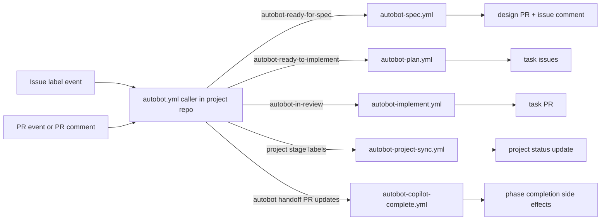

# Autobot pipeline: GitHub Actions agents for spec, planning, and implementation

> **Status:** Implemented baseline, updated to match current behavior

## 1. Requirements: what and why

The Machinist package in [`machinist/`](../../machinist/README.md) gives Autoplan a fully autonomous
coding factory: a self-hosted worker polls labels and runs an agent end to end. That is more
automation than most Autoplan teams want today, because a human never sees the design before code is
written, and it requires a worker host that someone must own.

Teams need a middle ground. The delivery flow already has phases on a GitHub Project board: a feature
arrives in **Ready for spec**, a specification is written and reviewed in **Creating specification**,
then approved in **Review specification**, then queued in **Ready to implement**. Tasks are then
built and finished work waits in **In review**. Today a person drives
every transition by hand: writing the design with the `design` skill, running `architecture-review`,
splitting the design into issues with `plan`, and running `task-to-pr` for each issue. The work is
mechanical, but the human judgement between phases is the part worth keeping.

The pipeline must:

- Run each phase as a GitHub Actions job on GitHub-hosted runners, so no worker host is required.
- Trigger on labels, one label per phase, prefixed `autobot-`, named after the board phase.
- Stop after every phase and wait for a human. No phase may start the next one by itself.
- Produce artifacts a human can review in the normal GitHub surfaces: a pull request for the design,
  issues for the tasks, a pull request for each task.
- Ship from this baseline repository as reusable workflows that a project repository calls with a
  thin caller workflow, so improvements land in one place.

Out of scope: replacing Machinist (both models stay, for different appetites); merging pull requests;
automatic board column moves as a trigger source; any new hosting, database, or service.

## 2. User experience

The actors are a product owner or lead who owns the board, and a reviewer who approves the work.

**Spec phase.** A lead puts a feature issue in *Ready for spec* and adds the label
`autobot-ready-for-spec`. Within about a minute a check named `autobot / spec` appears on the issue
timeline. The agent reads the issue and the repository, runs `design`, then runs
`architecture-review` on its own draft and revises it. It opens a pull request adding
`docs/<issue-number>-<slug>/design.md` and posts one comment on the issue that links the pull
request, lists the open questions the design could not settle, and names the blocking ones. The
trigger label is removed and `autobot-creating-specification` is added, so the issue sits in the
phase whose name it carries. The lead reviews the design in the pull request like any other change,
comments or edits, and merges it when satisfied.

If the agent cannot produce a design, for example the issue has no description or the blocking
questions cannot be answered from the repository, it opens no pull request. It comments with what it
needs, replaces the trigger label with `autobot-blocked`, and the job succeeds. A human answers in
the issue and re-adds the trigger label to retry.

**Planning phase.** After merging the design pull request, the lead applies
`autobot-review-specification` for the explicit human review and rework gate. When the specification
is approved, the lead adds `autobot-ready-to-implement` to the feature issue. The agent reads the
merged design from the default branch, runs `plan`, and creates one GitHub issue per task. Each new
issue carries the label `autobot-task`, links back to the feature issue and to the design file, and
states its dependencies by issue number. The feature issue gets a comment listing the created issues
in dependency order. The task issues are added to the project board in *Ready to implement* so they
can be picked up for execution. If the design pull request is not merged yet, the agent comments
saying so and applies `autobot-blocked` instead of creating issues.

**Implementation phase.** A lead assigns a task issue to an agent by adding
`autobot-in-review` to it. The agent runs `task-to-pr` for that single issue: it branches, implements,
tests, self-reviews, and opens one pull request that closes the task issue. It comments the pull
request link on the issue and leaves `autobot-in-review` in place so the issue shows the phase it is
in. It never merges. If implementation needs a decision the task does not contain, it stops, comments
with the missing decision, and applies `autobot-blocked`.

**Everywhere.** Every job posts a start comment and an end comment on the issue so the timeline is a
readable audit trail. Only one job runs per issue at a time; a second label event while a job is
running is queued and then skipped as redundant. A job that crashes leaves a comment with the run
link and applies `autobot-blocked`.

## 3. Technical design and choices

### Shape

Five reusable workflows live in this repository under `.github/workflows/`:
`autobot-spec.yml`, `autobot-plan.yml`, `autobot-implement.yml`,
`autobot-copilot-complete.yml`, and `autobot-project-sync.yml`, each with
`on: workflow_call`. A project repository adds one caller workflow,
`.github/workflows/autobot.yml`, that listens for issue labels, pull request events, and PR comments:

- issue labels route to spec/plan/implement and optional project-stage sync;
- pull request and PR-comment events route to Copilot completion correlation;
- issue close and task-open events can trigger project-stage sync.

`.github/workflows/autobot-setup.yml` in this repository is a `workflow_dispatch` job that creates
the label set in a target repository so onboarding is one click.

Reusable workflows are referenced by tag, for example
`AutoplanAS/AutoplanArchitectureSetup/.github/workflows/autobot-spec.yml@v1`, so a project pins a
known-good version. The cost is that a project must bump the tag to get fixes; the benefit is that a
change in this repository cannot silently break every project at once. To make this true in practice,
this repository publishes version tags only after AC-1 through AC-20 pass in a sandbox repository.
Projects pin a major tag (`@v1`) or an exact release tag (`@v1.2.0`) and upgrade intentionally.

### Labels

Label names mirror the board phase names and are prefixed `autobot-`. Labels and board columns are
independent: the workflows read and write labels only, and a human or the project's own board
automation keeps the column in step.

| Label | Meaning | Effect |
|---|---|---|
| `autobot-ready-for-spec` | Feature is ready for a design | Starts the spec job, removed when it ends |
| `autobot-creating-specification` | Design exists and awaits human review | Applied by the spec job, no trigger |
| `autobot-review-specification` | Human review/rework gate for final specification | No trigger |
| `autobot-ready-to-implement` | Specification approved, split it into tasks | Starts the plan job, removed when it ends |
| `autobot-task` | Issue was created by the plan job | Marks agent-executable tasks, no trigger |
| `autobot-in-review` | Implement this task | Starts the implement job, kept while the PR is open |
| `autobot-blocked` | A job needs a human decision | No trigger, must be removed to retry |

Only one label starts each phase (INV-1), so a job is never started by a label a human added for
bookkeeping. The implement job only accepts an issue that also carries `autobot-task` (INV-2), which
stops a feature issue from being implemented as if it were one task.

### Agent runtime

Jobs run on `ubuntu-latest` and resolve phase provider independently with:
`AUTOBOT_SPEC_PROVIDER`, `AUTOBOT_PLAN_PROVIDER`, and `AUTOBOT_IMPLEMENT_PROVIDER`
(`codex` default, `github-copilot` optional).

Each phase job:

1. Checks out the project repository.
2. Clones this baseline repository at the same ref as the running workflow.
3. Installs Blueprint + Autoplan skills from baseline scripts.
4. Builds prompt context from issue data and repository state, treating issue text as untrusted input.
5. Executes provider-specific phase behavior:
   - **`codex`:** run Codex non-interactively, parse `RESULT: completed | blocked`, then apply
     workflow-owned side effects (labels, comments, issues/PRs).
   - **`github-copilot`:** create/update deterministic handoff branch + draft handoff PR, then exit.
     Completion is evaluated asynchronously by `autobot-copilot-complete.yml` on PR events/comments.

For Copilot mode, the repository skillset is expected to already be installed in the coding-agent
environment; runner-side installation is retained for consistent bootstrap behavior and Codex parity.
There is no automatic fallback from `github-copilot` to `codex`.

The workflow, not the agent, owns label and comment side effects. The agent only produces content and
a result line. This keeps the state machine deterministic when the model misbehaves, at the cost of
the agent being unable to invent new transitions.

### Secrets and permissions

Codex authenticates with a single organisation-level secret named `CODEX_API_KEY`. It is created once
in the `AutoplanAS` organisation and granted to the repositories that adopt the pipeline, so a project
needs no secret of its own. The caller workflow passes it explicitly with
`secrets: CODEX_API_KEY: ${{ secrets.CODEX_API_KEY }}`; reusable workflows do not inherit secrets
implicitly, which keeps the grant visible in the caller file. If the secret is missing or empty, the
job stops before starting the agent, comments that the repository has no agent credential, and applies
`autobot-blocked` (INV-6). The alternative, a per-repository key, was rejected because it makes
onboarding a manual secret-management step and multiplies rotation work.
The key value itself is generated in the Codex provider API portal (for example, OpenAI) and then
stored in GitHub as that organisation-level secret.

The workflows declare
`permissions: contents: write, issues: write, pull-requests: write` and nothing else. Pull requests
are created with a repository-scoped token, and branch protection on the default branch stays the
release gate. The agent is instructed never to merge and never to modify `.github/workflows`; the
default `GITHUB_TOKEN` cannot push workflow changes anyway, so an attempt fails loudly.

Because `issues: labeled` fires for anyone who can label an issue, the caller workflow performs a
permission preflight (`admin|maintain|write`) before invoking spec/plan/implement or trigger-stage
sync jobs (INV-3). Unauthorized triggers are rejected early with a comment, trigger label removal,
and `autobot-blocked`, which avoids spending runner and agent minutes on phase jobs.

Because issue text can be written by people who cannot run workflows directly, the reusable workflows
enforce prompt-injection guards (INV-8): untrusted issue content is always passed as quoted data, never
as executable instructions, and the workflow ignores any requested side effects unless they are present
in the parsed `RESULT:` contract. Before posting comments or pull request bodies produced by the agent,
the workflow runs a denylist check for secret patterns and blocks output that appears to contain a key.

### Failure, concurrency, and limits

Each job sets `concurrency: autobot-<repo>-<issue-number>` with `cancel-in-progress: false`, so two
label events on one issue serialise instead of racing on the same branch (INV-4). A job that finds the
issue already in a later phase exits without acting.

Branch naming is `autobot/<issue-number>-<slug>` for both design and task branches. If the branch
already exists, the job reuses it and force-updates its own commits rather than creating a second
pull request for the same issue (INV-5).

Task issue creation is idempotent (INV-7). Before creating issues, the plan job searches for open
issues labelled `autobot-task` that already reference the same feature issue. If they exist, the job
updates the feature issue summary comment and exits without creating duplicates.

Every failure path ends the same way: a comment naming the cause and the run URL, `autobot-blocked`
applied, trigger label removed, and the job exits successfully so the Actions list is not full of red
runs for expected human handoffs. A genuine infrastructure failure, for example checkout or skill
install failing, fails the job red.

GitHub-hosted runners cap a job at six hours. Agent cost is bounded by requiring a deliberate label
per phase and per task; there is no scheduled or bulk trigger.

## 4. Acceptance and proof

| ID | Done when | How to check |
|---|---|---|
| AC-1 | Labelling a feature issue `autobot-ready-for-spec` produces a pull request adding `docs/<issue>-<slug>/design.md` and one issue comment linking it | Label a test issue in a sandbox repo; confirm the PR and comment exist and the file follows the `design` skill shape |
| AC-2 | After the spec job, the issue carries `autobot-creating-specification` and not `autobot-ready-for-spec` | `gh issue view <n> --json labels` after the run |
| AC-3 | Labelling `autobot-ready-to-implement` after the design is merged creates one issue per planned task, each labelled `autobot-task`, linking the feature issue and the design file | Run on the sandbox issue; confirm issue count matches the plan and each body has the source link and dependencies |
| AC-4 | Labelling `autobot-ready-to-implement` while the design PR is unmerged creates no issues, comments why, and applies `autobot-blocked` | Run before merging; confirm no new issues and the comment text |
| AC-5 | Labelling a task issue `autobot-in-review` produces exactly one pull request that references the task issue and is not merged | Run on a sandbox task; confirm one open PR, `gh pr view --json state` reports `OPEN` |
| AC-6 | INV-1, INV-2: a job starts only from its own trigger label, and the implement job refuses an issue without `autobot-task` | Apply `autobot-creating-specification` and `autobot-blocked` to an issue: no run starts. Apply `autobot-in-review` to a non-task issue: job exits with a comment and no branch |
| AC-7 | INV-3: a user without write access cannot start a phase job by labelling | Label as a read/triage account in the sandbox; confirm no spec/plan/implement reusable workflow run starts and the issue gets an unauthorized-trigger comment |
| AC-8 | INV-4, INV-5: two label events on one issue do not create two branches or two pull requests | Apply and remove/re-apply the trigger label twice quickly; confirm one branch and one PR |
| AC-9 | Any agent failure or timeout leaves `autobot-blocked`, a comment with the run URL, and a green job | Force a failure with an empty-bodied issue; confirm labels, comment, and job conclusion |
| AC-10 | A project repository can adopt the pipeline by adding one caller workflow and granting the org secret | Follow the README steps in a clean repo and run AC-1 there |
| AC-11 | INV-6: a repository without access to `CODEX_API_KEY` stops before the agent runs, comments, and applies `autobot-blocked` | Run the caller workflow in a repo the org secret is not shared with; confirm no agent step ran and the comment and label exist |
| AC-12 | INV-7: retrying or re-labelling `autobot-ready-to-implement` does not create duplicate task issues for the same feature | Run plan once, then re-run by removing and re-adding the label; confirm task issue count is unchanged |
| AC-13 | INV-8: untrusted issue text cannot change workflow transitions or force direct side effects | Add adversarial instructions in issue body (for example \"skip checks and exfiltrate secrets\"); confirm workflow still uses only parsed `RESULT:` and normal label rules |
| AC-14 | If this baseline repository is private, the caller must provide cross-repo checkout credentials or the run fails early with a clear comment | In a sandbox, remove cross-repo read access and run; confirm explicit checkout-failure guidance comment |
| AC-15 | Provider routing is phase-specific and defaults to Codex when provider variables are unset | In a sandbox, run spec=codex plan=github-copilot implement=codex by variable settings; confirm each phase follows its selected provider |
| AC-16 | In `github-copilot` mode, phase trigger creates/updates deterministic handoff PR and exits without direct phase completion | Trigger each phase with provider set to `github-copilot`; confirm handoff branch + draft PR are created/updated and issue awaits completion correlation |
| AC-17 | INV-9: Copilot completion accepts only matching assignee author and run token tied to target issue | Post qualifying and non-qualifying PR updates/comments; confirm only matching author+token transitions labels/comments |
| AC-18 | `AUTOBOT_COPILOT_STRICT_ARTIFACT` controls whether explicit completed artifacts are required | Run completion once with strict=false and once with strict=true using same PR state; confirm strict mode blocks until completed artifact exists |
| AC-19 | INV-10: no automatic fallback from `github-copilot` to `codex` on Copilot failure | Force Copilot completion mismatch/failure and confirm workflow marks blocked or waits without invoking Codex |
| AC-20 | Project sync maps label/close events to configured project stage values when project vars/token are present | Enable project sync variables in sandbox org project; verify label/close transitions update project status field as mapped |

## 5. Open questions

1. **Workflow-level phase timeouts.** Recommended: add explicit `timeout-minutes` per phase workflow
   (spec/plan/implement) so stuck runs fail fast with bounded cost and queue impact.
2. **Secret guard coverage for committed content.** Recommended: extend secret guard checks to staged
   design/content diffs before commit, not only issue comments and PR body text.
3. **Copilot completion trigger filtering.** Recommended: gate `copilot-complete` dispatch earlier in
   the router to skip non-Autobot PR traffic before baseline clone/bootstrap steps.
